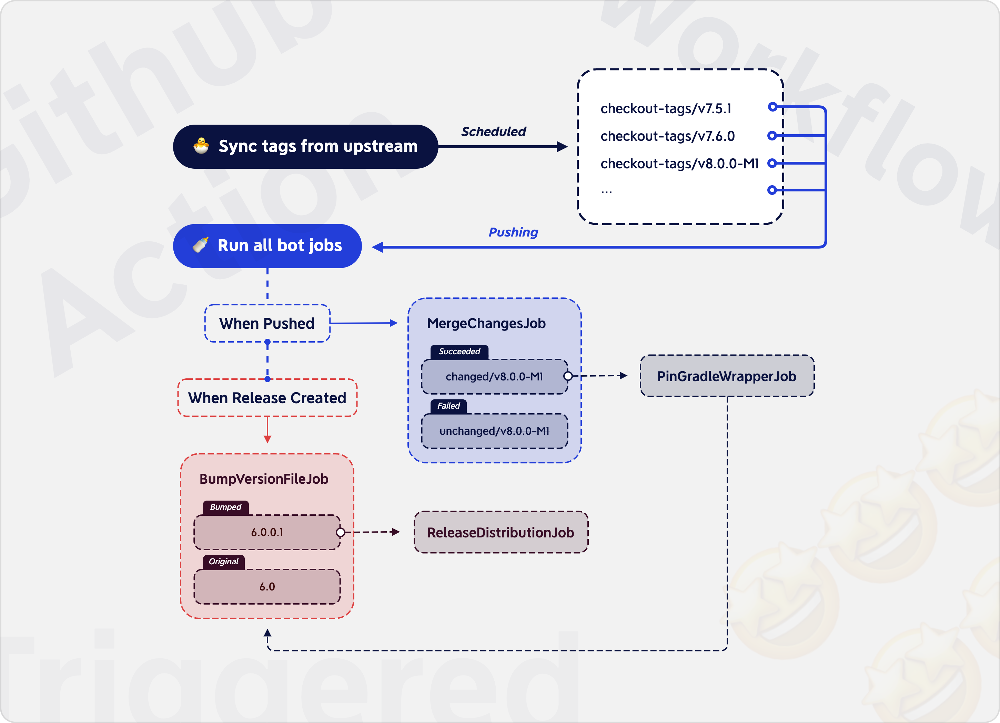

# Sweekt Gradle Bot

This is a robot that is all serving the **Sweekt** distribution, such as automatically processing **Gradle** upstream source code and distribution.

## Prerequisites

An important convention of the **Sweekt** distribution is that all changes with the distribution should only occur in the lowest version branch (Github default branch), and all subsequent synchronized new versions must be higher than this version, which means that we can merge these changes into branches of higher versions (and master & release).

## Jobs

#### Sync tags

Check out the new upstream tags and push them to the repository. 

#### Merge changes

Once any `checkout-tags/*` branch is created or any `changed/*` branch is updated, merge the default branch into this branch. But if the updated branch is the default branch, we need to merge the default branch into all other `changed/*` branches. If the merge fails, we should try to merge the lower `changed/*` branch than this branch version. Once all attempts fail, this branch will be renamed `unchanged/`, and then then the bot will open an issue to report these.

#### Pin Gradle wrapper

##### Motivation

When Gradle upstream is ready to release a new version, it will use the previous version or snapshot version to compile the source code. For example, when preparing to release `7.5.1`, it will use `7.5.1-snapshot` to compile the source code (https://github.com/gradle/gradle/blob/v7.5.1/gradle/wrapper/gradle-wrapper.properties#L3). However, the snapshot is not permanent. It will be removed by the server in the future. Fortunately, we just redistribute the Gradle version, so we can use a released version to compile our distribution. For example, we can compile our version `7.5.1.1` with version `7.5.1` (https://services.gradle.org/distributions/gradle-7.5.1-bin.zip).

##### Implementation

When the `changed/*` branch is created or updated, we just need to simply change the `distributionUrl` in `gradle/wrapper/gradle-wrapper.properties` to `https://services.gradle.org/distributions/gradle-$Version-bin.zip`.

#### Bump the version file

> **Note**
>
> The version number of the **Sweekt** distribution is marked after the [patch version](https://semver.org/#summary) of the Gradle version, such as:
>
> | Gradle Version | Sweekt-Gradle Version |
> | -------------- | --------------------- |
> | 7.0.0          | 7.0.0.1               |
> | 7.5.1          | 7.5.1.1               |
>
> The last `.1` means the special version number of the **Sweekt** distribution, which is managed by the **Github Release**.

Once any `changed/*` branch is pushed, its special version number in `version.txt` will be bumped to align with the latest version in the **Github Release**. In addition, if any new version is released in Github, all `changed/*` branches will also bump to that version.

~~And, it should be noted that we need to check whether the branch exists in the remote before pushing, otherwise it may mean that ["Merge changes"](#Merge changes) failed earlier.~~

#### Release the distribution

> We need to test the modules of the modified path before release, and only release our distribution when it is successful, otherwise, the bot should open an issue to report errors.

Every time the [Bump version](#Bump version) is completed (via checking whether the `version.txt` contains `release: *` commit), a new distribution will be added to the assets of the **Github latest release**.

#### Close issues

Any issue opened by the bot will be closed when the corresponding branch is pushed, as this usually means that the branch issues have been resolved manually.
